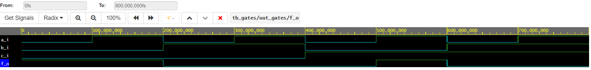

# lab 01-gates

| **c** | **b** |**a** | **f(c,b,a)** |
| :-: | :-: | :-: | :-: |
| 0 | 0 | 0 | 2 |
| 0 | 0 | 1 | 3 |
| 0 | 1 | 0 | 4 |
| 0 | 1 | 1 | 5 |
| 1 | 0 | 0 | 6 |
| 1 | 0 | 1 | 7 |
| 1 | 1 | 0 | 1 |
| 1 | 1 | 1 | 9 |

